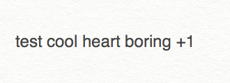
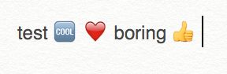

# Emojify service

Uses Automator to convert boring texts to 🆒 texts


boring|fun
---|---
|

[more demo](https://gfycat.com/YearlyHappygoluckyBilby)

# Installation

If you have [brew-cask](https://caskroom.github.io) installed you can use:

```
$ brew cask update && brew cask install emojify
```

Or get `Emojify.workflow` and put it in `~/Library/Services`

# Usage

Right click on selected text > services > Emojify

or

Go in System preferences > Keyboard > Shortcuts > Services > Emojify and add a shortcut you like

# License

Apache 2.0
